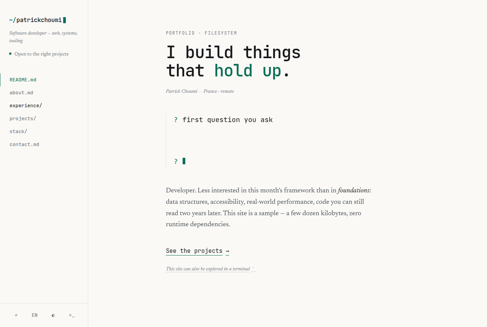
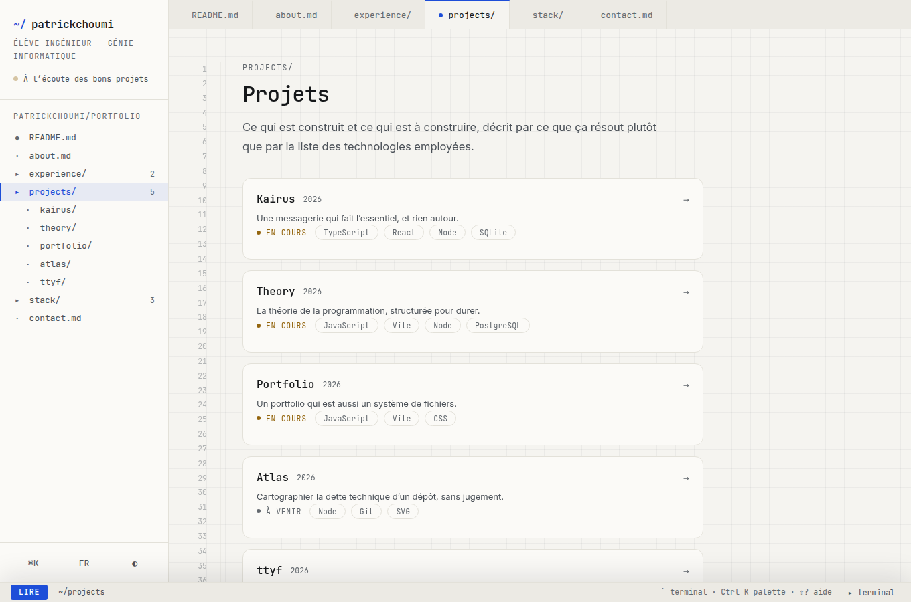
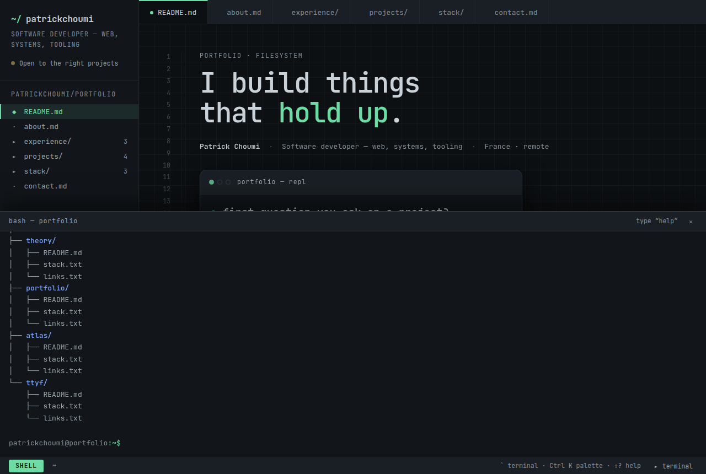
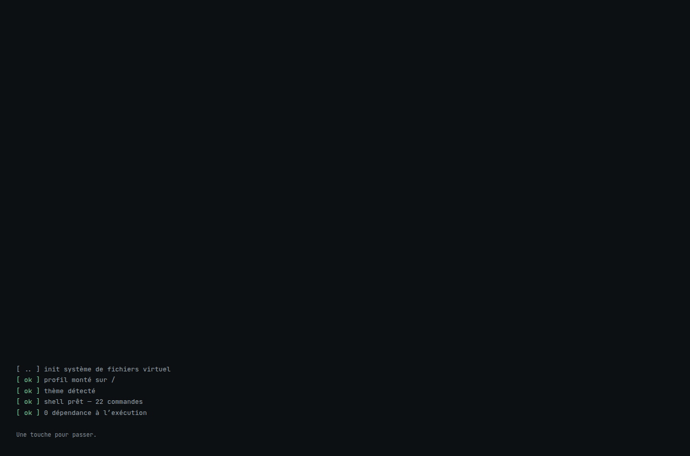
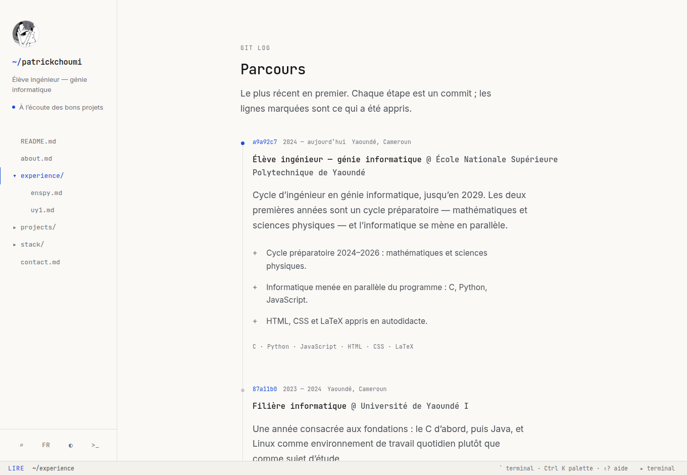

# patrickchoumi/portfolio

Un portfolio qui est aussi un système de fichiers.

Deux vues sur exactement la même matière : une page éditoriale qui se lit
normalement, et un terminal réel (touche <kbd>`</kbd>) où le contenu devient
une arborescence qu'on explore à la commande. Ce n'est pas une décoration :
`cd projects` déplace la page, cliquer sur un projet déplace le shell.



---

## L'idée

Un portfolio classique décrit la façon de travailler de son auteur. Celui-ci
la met en pratique sous les yeux du visiteur :

| Ce qui est affirmé | Ce qui le prouve, dans le site même |
| --- | --- |
| « Peu de dépendances » | zéro dépendance à l'exécution ; 33 Ko gzip de code (HTML + CSS + JS), plus 160 Ko de polices auto-hébergées |
| « Rien n'est envoyé nulle part » | aucune requête vers un tiers — polices auto-hébergées, aucun traceur, aucun cookie ; un test échoue si un hôte externe est contacté |
| « Les garanties se prouvent » | 46 tests unitaires + 26 vérifications navigateur, en CI — dont le responsive et le contraste, mesurés plutôt qu'affirmés |
| « La clarté est une fonctionnalité » | un seul fichier de données, dont la page, le terminal, la palette et le CV imprimé dérivent |

## Démarrer

```bash
npm install
npm run dev          # http://localhost:5173
```

| Commande | Effet |
| --- | --- |
| `npm run dev` | serveur de développement |
| `npm run build` | build de production dans `dist/` |
| `npm run preview` | sert le build, avec repli SPA |
| `npm test` | tests unitaires (logique pure, sans navigateur) |
| `npm run test:e2e` | build + harnais navigateur (Chromium) |
| `npm run check` | tout : tests, build, harnais |
| `npm run fonts` | re-télécharge et auto-héberge les polices |

## Personnaliser : un seul fichier

Tout le contenu vit dans **`src/data/profile.js`**. Il n'y a pas de texte en
dur dans le HTML, pas de « version texte » à tenir à jour en parallèle.
Modifier ce fichier met à jour, d'un coup :

- la page (accueil, à propos, parcours, projets, stack, contact) ;
- l'arborescence du terminal et le contenu de chaque fichier virtuel ;
- l'index de la palette de commandes ;
- le CV que produit `cv`, et la version imprimée du site.

Chaque champ traduisible est un objet `{ fr, en }`. Une chaîne nue est
utilisée telle quelle dans les deux langues (pratique pour les noms propres).

```js
export const projects = [
  {
    slug: 'atlas',                    // → /projets/atlas et projects/atlas/
    name: 'Atlas',
    year: '2026',
    status: 'planned',                // live | wip | planned | archived
    tagline: { fr: '…', en: '…' },
    summary: { fr: '…', en: '…' },
    highlights: { fr: ['…'], en: ['…'] },
    metrics: [{ label: { fr: 'commits/s', en: 'commits/s' }, value: '~9k' }],
    stack: ['Node', 'Git'],
    links: [{ label: { fr: 'Code', en: 'Source' }, url: 'https://…' }]
  }
];
```

L'audit de contenu (`npm test`) refuse les dérives courantes : slug dupliqué,
traduction manquante, nombre de faits marquants différent entre les langues,
parcours qui n'est plus antéchronologique, accroche trop longue pour sa
rangée, lien relatif là où il faut une URL absolue, ou nom de techno accentué
laissé en français dans la version anglaise.

**`status` sert à ne pas mentir.** Un projet qui n'est pas commencé n'est ni
`live` ni `wip` : il est `planned`, et la page l'affiche « à venir », en gris
plutôt qu'en couleur. La description dit alors une intention, pas un résultat.

> ⚠️ Si tu repars de ce dépôt : le contenu de `profile.js` est le parcours de
> son auteur. Remplace-le par le tien avant de publier.



## Le terminal



Ouvrir : <kbd>`</kbd> ou <kbd>²</kbd> (même touche physique en AZERTY), ou le
bouton `▸ terminal` de la barre de statut.

```
/
├── about.md          principles.md    resume.md    contact.md
├── experience/       README.md (git log) + un .md par poste
├── projects/         un dossier par projet : README.md, stack.txt, links.txt
└── stack/            un .txt par groupe
```

Vingt-deux commandes : `ls` (`-a`, `-l`), `cd`, `pwd`, `cat`, `tree`, `find`,
`grep`, `open`, `whoami`, `neofetch`, `cv`, `print`, `mail`, `theme`, `lang`,
`history`, `clear`, `date`, `echo`, `uname`, `exit` — plus quelques-unes qui
ne sont pas dans `help`.

- <kbd>Tab</kbd> complète les commandes et les chemins (préfixe commun le plus long) ;
- <kbd>↑</kbd> <kbd>↓</kbd> parcourent un historique persistant ;
- <kbd>Ctrl</kbd>+<kbd>L</kbd> efface, <kbd>Ctrl</kbd>+<kbd>C</kbd> annule, <kbd>Échap</kbd> ferme ;
- un pipe est accepté, vers `grep` uniquement : `cat about.md | grep clarté` ;
- une commande mal tapée propose la plus proche (distance de Levenshtein).

Le terminal est un **bonus, jamais un péage** : tout le contenu est lisible
sans jamais l'ouvrir.

## La séquence de démarrage



Le site s'ouvre sur un log de boot. C'est une petite mise en scène assumée —
elle annonce la couleur en trois secondes — mais elle est tenue par trois
garde-fous, sans quoi elle deviendrait une nuisance :

- **une seule fois par session** (`sessionStorage`) : recharger la page ne la
  rejoue pas ;
- **jamais sur un lien profond** : arriver sur `/projets/theory` depuis un
  lien partagé doit montrer la fiche, pas un écran de chargement ;
- **jamais en `prefers-reduced-motion`**, et n'importe quelle touche ou un
  clic la coupe immédiatement.

Les trois se vérifient dans le harnais navigateur : chacun peut se casser sans
rien casser d'autre. Le nombre de commandes annoncé (« shell prêt — 22
commandes ») est compté sur le registre, pas écrit à la main.

## Raccourcis clavier

| Touche | Effet |
| --- | --- |
| <kbd>`</kbd> / <kbd>²</kbd> | ouvre ou ferme le terminal |
| <kbd>Ctrl</kbd>/<kbd>⌘</kbd>+<kbd>K</kbd> | palette : sections, fichiers, commandes, liens |
| <kbd>?</kbd> | ouvre le terminal sur `help` |
| <kbd>Échap</kbd> | ferme ce qui est ouvert |

## Architecture

```
index.html              charpente : des conteneurs, aucun contenu
src/data/profile.js     ← la source unique de vérité
src/data/fs.js          projette profile.js en arborescence explorable
src/data/lang.js        sélection de langue (pur, testable)
src/js/main.js          orchestration — une route, deux vues
src/js/render.js        rendu de la page depuis les données
src/js/shell.js         moteur du terminal (historique, complétion, pipe)
src/js/commands.js      registre des commandes (pur, testable)
src/js/palette.js       palette Ctrl+K
src/js/router.js        routes réelles (History API), analyse pure
src/js/i18n.js          FR/EN, sans rechargement
src/js/repl.js          le REPL animé de l'accueil
src/js/boot.js          séquence de démarrage (une fois par session)
src/js/effects.js       révélation au défilement + easter egg
src/styles/main.css     design system « éditeur »
scripts/fetch-fonts.mjs auto-hébergement des polices
tests/                  46 tests node:test — logique pure
tests-e2e/browser.mjs   26 vérifications navigateur
```

Le principe structurant : **`navigate()` est le seul point de passage**. Clic
dans l'explorateur, entrée de la palette, commande `cd`, bouton Précédent du
navigateur, lien profond — tout converge au même endroit, qui met à jour la
section, l'URL, les onglets, l'explorateur et le répertoire courant du shell.

## Design

Filiation assumée avec le système « Terminal » du projet *Theory* : monospace
pour l'ossature, sans-serif pour la prose, filets fins, un seul accent, palette
d'éditeur claire et sombre. Ce qui change ici : l'interface n'imite pas un
terminal, elle **est** un éditeur ouvert sur un dépôt — barre latérale =
arborescence, section = buffer avec son onglet et sa gouttière de numéros de
ligne, barre de statut en bas, terminal escamotable.

- **Typographie** : JetBrains Mono (ossature) + Inter (prose), auto-hébergées.
- **Couleur** : un seul accent, un **bleu** décliné clair/sombre — celui des
  dossiers dans un `ls`, celui d'un lien dans un éditeur. Un vert phosphore a
  été essayé et retiré : il tirait l'ensemble vers l'écran cathodique, alors
  que la page se veut un poste de travail d'aujourd'hui. Le vert ne reste que
  là où il veut dire quelque chose : le `[ ok ]` du log de démarrage et le `+`
  d'un diff. Tous les couples texte/fond visent au minimum le ratio AA (4,5:1).
- **Pas de photo de profil.** Un portrait a été essayé et retiré : l'identité
  d'un poste de travail, c'est son invite. Le site s'identifie par son `~/` et
  par la vignette en caractères de `neofetch`.
- **La stack sans jauges.** « Quatre sur cinq » ne veut rien dire pour qui lit,
  et beaucoup trop pour qui l'écrit. Une phrase honnête à la place.
- **Mouvement** : `prefers-reduced-motion` coupe le REPL animé, la séquence de
  démarrage, la révélation au défilement et l'easter egg.



## Responsive et accessibilité

Rien de tout cela n'est déclaratif : cinq vérifications du harnais parcourent
les sept routes à huit largeurs — de 320 px, le plus petit téléphone encore en
circulation, à 1920 px — et échouent si l'une des garanties suivantes cède.

| Garantie | Comment elle est tenue |
| --- | --- |
| Aucun défilement horizontal | mesuré sur chaque route à chaque largeur |
| Cibles tactiles ≥ 24 px | WCAG 2.2, critère 2.5.8 (AA), sur tout ce qui est cliquable |
| Contraste AA | 4,5:1 (3:1 pour le grand texte), dans les **deux** thèmes, en composant les fonds semi-transparents |
| Le terminal utilisable au doigt | on ouvre, on tape `cd`, on vérifie que ça répond — sur 320 px |
| Barre latérale escamotée hors du clavier | fermée, elle sort aussi du parcours de tabulation |

Trois défauts réels ont été trouvés de cette façon, et corrigés :

- **Le champ de saisie du terminal tombait à zéro pixel de large.** L'invite
  `patrickchoumi@portfolio:~/projects/kairus$` fait 335 px et ne rétrécit pas :
  sur un téléphone il ne restait plus rien pour taper. La rangée passe
  désormais à la ligne, le champ garde un plancher de 12 caractères, et
  au-dessous de 520 px l'invite abandonne `user@host` pour ne garder que le
  chemin — l'arbitrage de n'importe quel `PS1` dans un terminal serré.
- **La barre latérale escamotée restait tabulable.** Hors de l'écran par un
  `translateX`, elle laissait traverser six liens invisibles avant le contenu,
  et un lecteur d'écran les annonçait. Elle passe en `visibility: hidden`,
  qui se transitionne — l'animation d'ouverture est conservée.
- **`--text-tertiary` mentait sur son propre contraste.** Le token annonçait
  « ≥ 4,5:1 sur `--bg` », ce qui était vrai — mais il servait surtout sur
  `--surface-2`, où il tombait à 4,15:1. Recalé sur le pire cas.

Par ailleurs : lien d'évitement, navigation entièrement au clavier,
`:focus-visible` visible partout, un seul `h1` par section et aucun saut de
niveau, `aria-current="page"` sur l'entrée courante, sortie du terminal en
`role="log"` / `aria-live="polite"`, animations coupées sur demande du
système.

## Déploiement

Le build produit un `dist/` entièrement statique. Le site utilise des routes
réelles : configure le repli SPA vers `index.html`.

| Hébergeur | À faire |
| --- | --- |
| Netlify | `/* /index.html 200` dans `_redirects` |
| Vercel | rewrite `/(.*)` → `/index.html` |
| Cloudflare Pages | automatique |
| nginx | `try_files $uri $uri/ /index.html;` |
| GitHub Pages | copier `index.html` en `404.html` |

## Licence

Le code est réutilisable. Le contenu (parcours, projets, textes) appartient à
son auteur — remplace-le par le tien. Les polices sont sous SIL Open Font
License 1.1 (voir `public/fonts/LICENSE.txt`).
