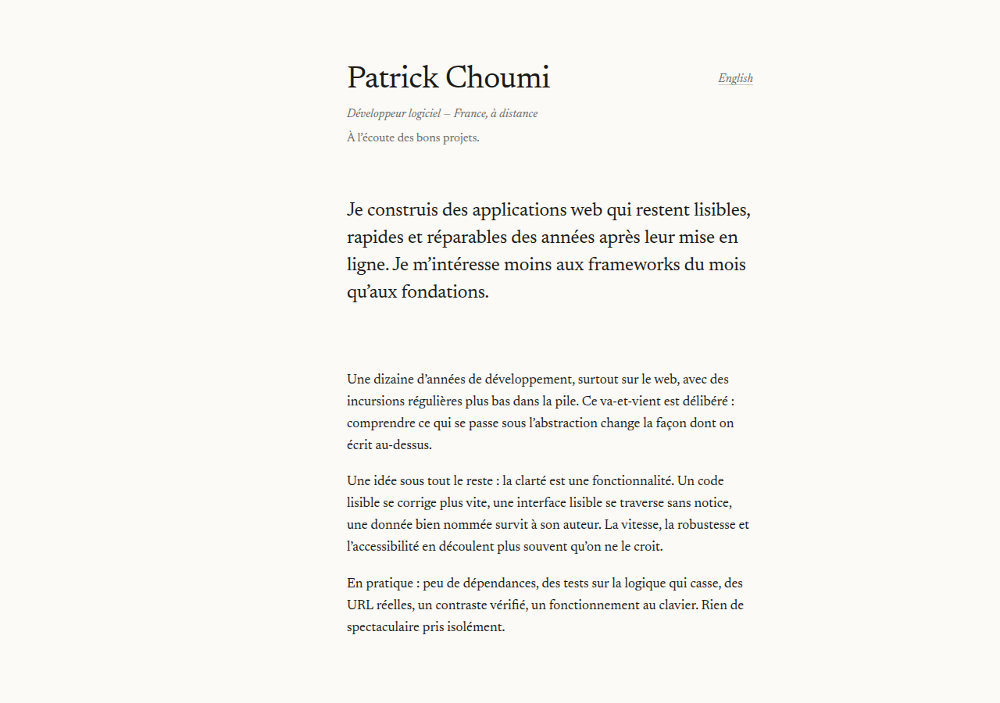

# patrickchoumi/portfolio

**Deux propositions, deux partis pris opposés.** Le contenu est comparable ;
tout le reste diverge. Elles cohabitent dans ce dépôt pour être comparées
côte à côte — l'une finira par être publiée, pas les deux.

| | [**Terminal**](#un-portfolio-qui-est-aussi-un-système-de-fichiers) (ce dossier) | [**Document**](minimal/) (`minimal/`) |
| --- | --- | --- |
| Idée | Le portfolio est un système de fichiers explorable | Le portfolio est un document imprimé qui se trouve être à l'écran |
| Interaction | Terminal réel, palette, routes, thème, bilingue à chaud | Dépli natif `<details>`, deux pages, un lien |
| Typographie | JetBrains Mono + Inter, deux voix | Newsreader seul, une graisse |
| Couleur | Un accent vert phosphore, thème clair/nuit | Aucune. Encre sur papier |
| JavaScript | 24 Ko gzip | **0 octet** |
| Outillage | Vite | Aucun — 100 lignes de Node |
| Poids total | ~90 Ko gzip | 7 Ko gzip par page, 91 Ko avec les polices |
| Tests | 46 unitaires + 18 navigateur | 21 unitaires |

<table>
<tr>
<td width="50%"></td>
<td width="50%"></td>
</tr>
<tr><td align="center"><em>Terminal</em></td><td align="center"><em>Document</em></td></tr>
</table>

Ce qui suit documente la variante **terminal**. Pour l'autre, voir
[`minimal/README.md`](minimal/README.md).

---

## Un portfolio qui est aussi un système de fichiers

Deux vues sur exactement la même matière : une page éditoriale qui se lit
normalement, et un terminal réel (touche <kbd>`</kbd>) où le contenu devient
une arborescence qu'on explore à la commande. Ce n'est pas une décoration :
`cd projects` déplace la page, cliquer sur un projet déplace le shell.

---

## L'idée

Un portfolio classique décrit la façon de travailler de son auteur. Celui-ci
la met en pratique sous les yeux du visiteur :

| Ce qui est affirmé | Ce qui le prouve, dans le site même |
| --- | --- |
| « Peu de dépendances » | zéro dépendance à l'exécution ; ~90 Ko gzip, polices comprises |
| « Rien n'est envoyé nulle part » | aucune requête vers un tiers — polices auto-hébergées, aucun traceur, aucun cookie ; un test échoue si un hôte externe est contacté |
| « Les garanties se prouvent » | 46 tests unitaires + 18 vérifications navigateur, en CI |
| « La clarté est une fonctionnalité » | un seul fichier de données, dont la page, le terminal, la palette et le CV imprimé dérivent |

## Démarrer

```bash
npm install
npm run dev          # http://localhost:5173
```

| Commande | Effet |
| --- | --- |
| `npm run dev` | serveur de développement |
| `npm run build` | build de production dans `dist/` |
| `npm run preview` | sert le build, avec repli SPA |
| `npm test` | tests unitaires (logique pure, sans navigateur) |
| `npm run test:e2e` | build + harnais navigateur (Chromium) |
| `npm run check` | tout : tests, build, harnais |
| `npm run fonts` | re-télécharge et auto-héberge les polices |

## Personnaliser : un seul fichier

Tout le contenu vit dans **`src/data/profile.js`**. Il n'y a pas de texte en
dur dans le HTML, pas de « version texte » à tenir à jour en parallèle.
Modifier ce fichier met à jour, d'un coup :

- la page (accueil, à propos, parcours, projets, stack, contact) ;
- l'arborescence du terminal et le contenu de chaque fichier virtuel ;
- l'index de la palette de commandes ;
- le CV que produit `cv`, et la version imprimée du site.

Chaque champ traduisible est un objet `{ fr, en }`. Une chaîne nue est
utilisée telle quelle dans les deux langues (pratique pour les noms propres).

```js
export const projects = [
  {
    slug: 'atlas',                    // → /projets/atlas et projects/atlas/
    name: 'Atlas',
    year: '2024',
    status: 'wip',                    // live | wip | archived
    tagline: { fr: '…', en: '…' },
    summary: { fr: '…', en: '…' },
    highlights: { fr: ['…'], en: ['…'] },
    metrics: [{ label: { fr: 'commits/s', en: 'commits/s' }, value: '~9k' }],
    stack: ['Node', 'Git'],
    links: [{ label: { fr: 'Code', en: 'Source' }, url: 'https://…' }]
  }
];
```

L'audit de contenu (`npm test`) refuse les dérives courantes : slug dupliqué,
traduction manquante, nombre de faits marquants différent entre les langues,
parcours qui n'est plus antéchronologique, jauge de compétence hors de 1–5,
lien relatif là où il faut une URL absolue.

> ⚠️ Les données livrées sont un **canevas crédible**, pas une biographie :
> remplace-les par ton parcours réel avant de publier.

## Le terminal


Ouvrir : <kbd>`</kbd> ou <kbd>²</kbd> (même touche physique en AZERTY), ou le
bouton `▸ terminal` de la barre de statut.

```
/
├── about.md          principles.md    resume.md    contact.md
├── experience/       README.md (git log) + un .md par poste
├── projects/         un dossier par projet : README.md, stack.txt, links.txt
└── stack/            un .txt par groupe de compétences
```

Vingt commandes : `ls` (`-a`, `-l`), `cd`, `pwd`, `cat`, `tree`, `find`,
`grep`, `open`, `whoami`, `neofetch`, `cv`, `print`, `mail`, `theme`, `lang`,
`history`, `clear`, `date`, `echo`, `uname`, `exit` — plus quelques-unes qui
ne sont pas dans `help`.

- <kbd>Tab</kbd> complète les commandes et les chemins (préfixe commun le plus long) ;
- <kbd>↑</kbd> <kbd>↓</kbd> parcourent un historique persistant ;
- <kbd>Ctrl</kbd>+<kbd>L</kbd> efface, <kbd>Ctrl</kbd>+<kbd>C</kbd> annule, <kbd>Échap</kbd> ferme ;
- un pipe est accepté, vers `grep` uniquement : `cat about.md | grep clarté` ;
- une commande mal tapée propose la plus proche (distance de Levenshtein).

Le terminal est un **bonus, jamais un péage** : tout le contenu est lisible
sans jamais l'ouvrir.

## Raccourcis clavier

| Touche | Effet |
| --- | --- |
| <kbd>`</kbd> / <kbd>²</kbd> | ouvre ou ferme le terminal |
| <kbd>Ctrl</kbd>/<kbd>⌘</kbd>+<kbd>K</kbd> | palette : sections, fichiers, commandes, liens |
| <kbd>?</kbd> | ouvre le terminal sur `help` |
| <kbd>Échap</kbd> | ferme ce qui est ouvert |

## Architecture

```
index.html              charpente : des conteneurs, aucun contenu
src/data/profile.js     ← la source unique de vérité
src/data/fs.js          projette profile.js en arborescence explorable
src/data/lang.js        sélection de langue (pur, testable)
src/js/main.js          orchestration — une route, deux vues
src/js/render.js        rendu de la page depuis les données
src/js/shell.js         moteur du terminal (historique, complétion, pipe)
src/js/commands.js      registre des commandes (pur, testable)
src/js/palette.js       palette Ctrl+K
src/js/router.js        routes réelles (History API), analyse pure
src/js/i18n.js          FR/EN, sans rechargement
src/js/repl.js          le REPL animé de l'accueil
src/js/boot.js          séquence de démarrage (une fois par session)
src/js/effects.js       révélation au défilement + easter egg
src/styles/main.css     design system « éditeur »
scripts/fetch-fonts.mjs auto-hébergement des polices
tests/                  46 tests node:test — logique pure
tests-e2e/browser.mjs   18 vérifications navigateur
```

Le principe structurant : **`navigate()` est le seul point de passage**. Clic
dans l'explorateur, entrée de la palette, commande `cd`, bouton Précédent du
navigateur, lien profond — tout converge au même endroit, qui met à jour la
section, l'URL, les onglets, l'explorateur et le répertoire courant du shell.

## Design

Filiation assumée avec le système « Terminal » du projet *Theory* : monospace
pour l'ossature, sans-serif pour la prose, filets fins, un seul accent, palette
d'éditeur claire et sombre. Ce qui change ici : l'interface n'imite pas un
terminal, elle **est** un éditeur ouvert sur un dépôt — barre latérale =
arborescence, section = buffer avec son onglet et sa gouttière de numéros de
ligne, barre de statut en bas, terminal escamotable.

- **Typographie** : JetBrains Mono (ossature) + Inter (prose), auto-hébergées.
- **Couleur** : un seul accent, un vert phosphore décliné clair/sombre. Tous
  les couples texte/fond visent au minimum le ratio AA (4,5:1).
- **Mouvement** : `prefers-reduced-motion` coupe le REPL animé, la séquence de
  démarrage, la révélation au défilement et l'easter egg.


## Accessibilité

Lien d'évitement, navigation entièrement au clavier, `:focus-visible` visible
partout, contrastes vérifiés dans les deux thèmes, sortie du terminal en
`role="log"` / `aria-live="polite"`, jauges de compétence doublées d'un texte
lisible par lecteur d'écran, animations coupées sur demande du système.

## Déploiement

Le build produit un `dist/` entièrement statique. Le site utilise des routes
réelles : configure le repli SPA vers `index.html`.

| Hébergeur | À faire |
| --- | --- |
| Netlify | `/* /index.html 200` dans `_redirects` |
| Vercel | rewrite `/(.*)` → `/index.html` |
| Cloudflare Pages | automatique |
| nginx | `try_files $uri $uri/ /index.html;` |
| GitHub Pages | copier `index.html` en `404.html` |

## Licence

Le code est réutilisable. Le contenu (parcours, projets, textes) appartient à
son auteur — remplace-le par le tien. Les polices sont sous SIL Open Font
License 1.1 (voir `public/fonts/LICENSE.txt`).
